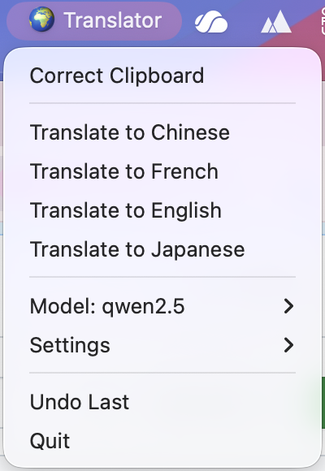
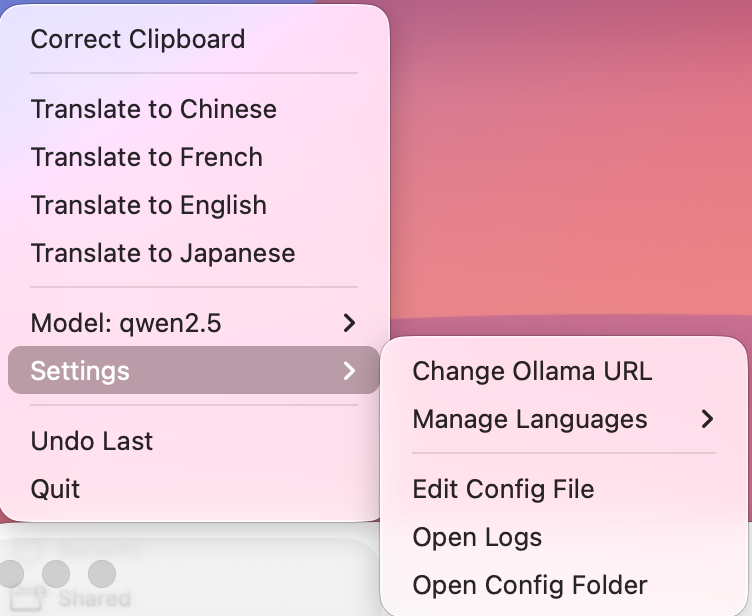

# Smart Translator for macOS

A macOS menu bar app for instant text correction, translation, and **custom clipboard skills** — powered by your choice of local LLMs via [Ollama](https://ollama.com) or the [Gemini API](https://ai.google.dev/).

**v1.2.0** — dual-provider support (Ollama + Gemini), Gemini 2.5 models, provider switching from the menu bar.

## Screenshots

| Menu | Menu Bar | Processing | Settings |
|------|----------|------------|----------|
|  |  |  |  |

## Key Features

- **Dual Provider** — Switch between **Ollama** (fully local, private) and **Gemini API** (cloud, faster) at any time from the menu bar.
- **Gemini 2.5** — Ships with `gemini-2.5-flash-lite` as the default cloud model; `gemini-2.5-flash`, `gemini-2.5-pro`, and older models also available.
- **Global Hotkey** — Press `Ctrl + Cmd + C` to instantly correct whatever text is selected on screen.
- **Custom Skills** — Define your own clipboard processing actions. Describe what you want, the active LLM generates a refined prompt, you review it, then it's saved to the menu.
- **Translation** — Translate clipboard text to any language. Add and remove target languages on the fly.
- **Smart Correction** — Fix grammar, spelling, and clarity while preserving language and formatting.
- **Token Saver** — Two built-in variants: a deterministic *safe* cleaner and an *aggressive* LLM-based compressor.
- **Clipboard History & Undo** — Keeps up to 10 clipboard states; one-click undo restores the previous value.
- **Async Processing** — All LLM calls run in background threads; the menu bar stays responsive throughout.
- **Dynamic Model Selection** — Switch between Ollama models or Gemini models at runtime, or refresh the list from the API.

## Providers

### Ollama (local)
Runs entirely on your machine. No data leaves your device.

- Install Ollama: [ollama.com](https://ollama.com)
- Pull a model:
  ```bash
  ollama pull llama3.2      # fast
  ollama pull mistral       # higher quality
  ```
- The app defaults to `http://localhost:11434`; change it via **⚙️ Settings → Change Ollama URL**.

### Gemini API
Uses Google's Gemini REST API. Requires an API key.

- Get a key at [aistudio.google.com](https://aistudio.google.com/apikey) (free tier available).
- Set it via **⚙️ Settings → Change Gemini API Key**, or export it in your shell:
  ```bash
  export GEMINI_API_KEY=your_key_here
  ```
- Default model: `gemini-2.5-flash-lite`. Change via **⚙️ Settings → Change Gemini Model**.
- **Transport options** (set via **Change Gemini Transport**):
  - `api` — REST API only (recommended)
  - `playwright` — browser-based fallback via a persistent Chromium session (requires `playwright install chromium`)
  - `auto` — tries API first, falls back to Playwright

## Custom Skills

1. Click **⚙️ Settings → Manage Skills → Add Skill...**
2. **Describe** what you want the skill to do (e.g. "remove HTML tags and return clean text")
3. The active LLM **generates a refined prompt** with strong output constraints
4. **Review and edit** the prompt before saving
5. Your skill appears in the main menu immediately

Built-in skills include Token Saver, Debug Helper, Error Condenser, Explain Code, Git Commit Message, JSON Cleaner, Log Extractor, and SQL from Error.

## Installation

### Build as a macOS App (recommended)

```bash
pip install rumps requests pyperclip py2app pynput
chmod +x build_script.sh
./build_script.sh
```

Grant **Accessibility** and **Notifications** permissions when prompted on first launch.

### Run from source

```bash
pip install rumps requests pyperclip pynput
python3 smart_translator_dynamic.py
```

For Playwright fallback support, also run:
```bash
pip install playwright
python3 -m playwright install chromium
```

## Usage

1. **Copy** text to your clipboard (or just select text anywhere)
2. Press **`Ctrl + Cmd + C`** for instant correction, or click the 🌍 menu bar icon and choose an action
3. Wait for the **Success** notification
4. **Paste** the processed result

To switch providers, open the menu bar icon and look for the **Provider** submenu (Ollama / Gemini).

## Configuration

All config is stored at `~/Library/Application Support/SmartTranslator/config.json`.

| Setting | Where to change |
|---|---|
| Ollama URL | ⚙️ Settings → Change Ollama URL |
| Gemini API key | ⚙️ Settings → Change Gemini API Key |
| Gemini model | ⚙️ Settings → Change Gemini Model |
| Gemini transport (`api`/`playwright`/`auto`) | ⚙️ Settings → Change Gemini Transport |
| Languages | ⚙️ Settings → Manage Languages |
| Skills | ⚙️ Settings → Manage Skills |
| Raw config | ⚙️ Settings → Edit Config File |
| Logs | ⚙️ Settings → Open Logs (`~/Library/Logs/SmartTranslator/`) |

## Troubleshooting

| Problem | Fix |
|---|---|
| Hotkey not working | Add the app to *System Settings → Privacy & Security → Accessibility* |
| `❌ Offline` with Ollama | Run `ollama serve` in a terminal |
| `❌ Offline` with Gemini | Check your API key and internet connection |
| Playwright not found | Run `pip install playwright && python3 -m playwright install chromium` |
| UI issues | Check logs via ⚙️ Settings → Open Logs |
